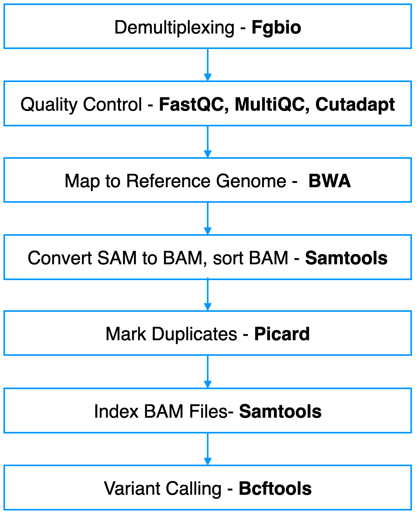

# [Palmer Lab](https://palmerlab.org/) :test_tube: California Mice Genotyping Pipeline
## Overview
This [github repository](https://github.com/Deeeeen/california_mouse_genotyping) is to document Palmer Lab's California Mice (Peromyscus Californicus) Genotyping Pipeline.

## Contents
- **[genotyping](genotyping)**: This folder contains the code for genotyping steps.

## Pipeline Overview

